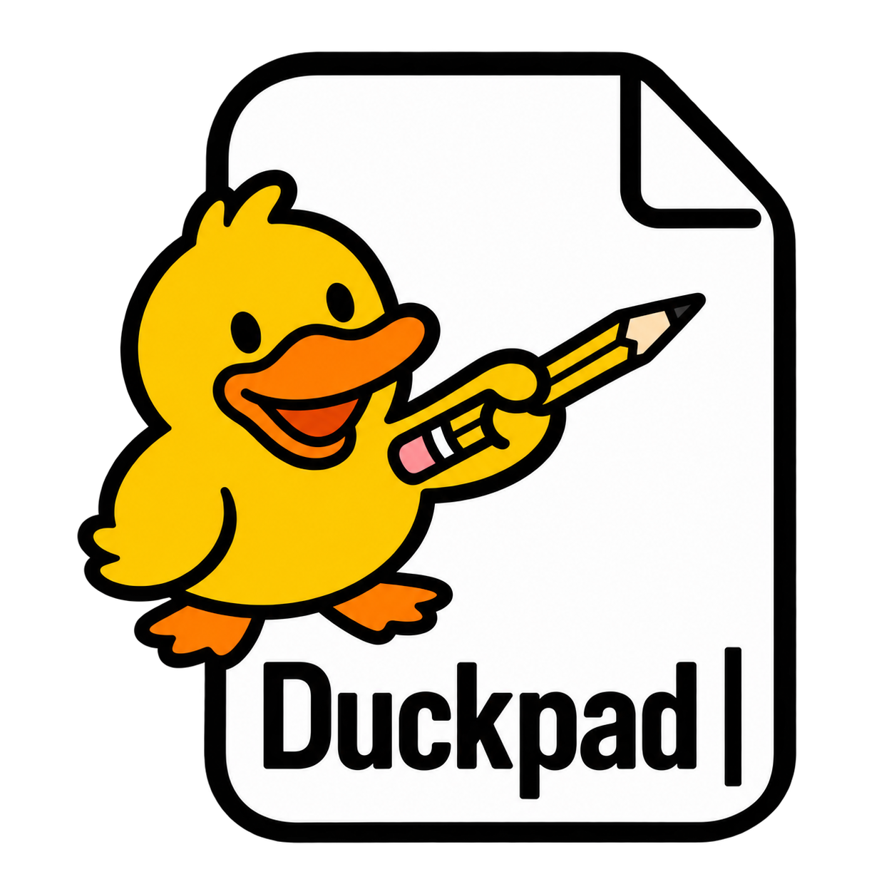

# Duckpad

  

Duckpad is a text and code editor for macOS, inspired by [Notepad++](https://github.com/notepad-plus-plus/notepad-plus-plus).

It brings familiar text editing to the Mac with native menus, multiple document tabs, split editor groups, syntax highlighting, search and replace, and document comparison.

## Download

[Download Duckpad](https://github.com/namJeongwan/duckpad/releases/latest)

Requires macOS 13 or later. Supports Apple Silicon and Intel Macs.

This early release is not notarized by Apple. See the release notes for installation instructions.

## Languages

- [ ] English
- [ ] Korean
- [ ] Japanese
- [ ] Chinese (Simplified)
- [ ] Portuguese (Brazil)
- [ ] Italian
- [ ] French
- [ ] German
