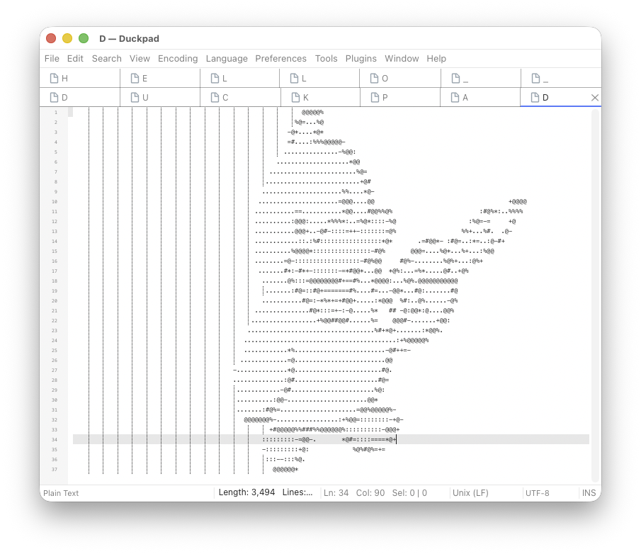

# Duckpad

<p align="center">
  
</p>

Duckpad is a text and code editor for macOS, inspired by [Notepad++](https://github.com/notepad-plus-plus/notepad-plus-plus).

It brings familiar text editing to the Mac with native menus, multiple document tabs, split editor groups, syntax highlighting, search and replace, and document comparison.



## Download

[Download Duckpad](https://github.com/namJeongwan/duckpad/releases/latest)

Requires macOS 13 or later. Supports Apple Silicon and Intel Macs.

This early release is not notarized by Apple. See the release notes for installation instructions.

## Development

Requires macOS and Xcode Command Line Tools with Swift 6 or later. Run the commands below from the repository root.

```sh
swift run DuckpadApp
```

## Build

Create a universal `.app` for Apple Silicon and Intel Macs:

```sh
scripts/build_macos_app.sh --output build/Duckpad.app
```

Add `--architecture native` to build only for your Mac. The output path must not already exist. The default build uses ad-hoc signing without Apple notarization.

## Languages

- [ ] English
- [ ] Korean
- [ ] Japanese
- [ ] Chinese (Simplified)
- [ ] Portuguese (Brazil)
- [ ] Italian
- [ ] French
- [ ] German
